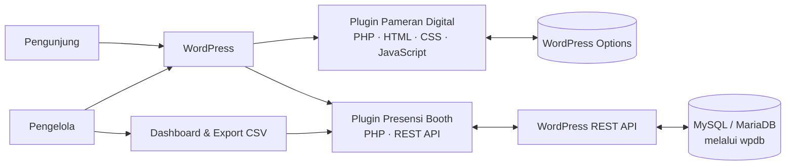

<p align="center">
  
</p>

<h1 align="center">ASSIE IV · Plugin Suite</h1>

<p align="center">
  Pengalaman pameran digital dan presensi pengunjung untuk<br>
  <strong>Airlangga Startup Summit &amp; Innovation Expo 2026</strong>.
</p>

<p align="center">
  <a href="https://wordpress.org/"></a>
  <a href="https://www.php.net/"></a>
  <a href="https://developer.mozilla.org/docs/Web/JavaScript"></a>
  <a href="https://developer.mozilla.org/docs/Web/HTML"></a>
  <a href="https://developer.mozilla.org/docs/Web/CSS"></a>
  <a href="https://www.mysql.com/"></a>
</p>

<p align="center">
  <a href="#fitur">Fitur</a> ·
  <a href="#arsitektur">Arsitektur</a> ·
  <a href="#instalasi">Instalasi</a> ·
  <a href="#penggunaan">Penggunaan</a> ·
  <a href="#api-presensi">REST API</a>
</p>

---

## Tentang proyek

Repository ini berisi dua plugin WordPress yang mendukung kebutuhan utama ASSIE IV 2026. Plugin pameran menyajikan informasi acara dan tenant kepada pengunjung; plugin presensi mencatat kunjungan booth dan menyediakan rekap untuk pengelola.

| Plugin | Versi source | Fungsi |
| --- | :---: | --- |
| **ASSIE IV — Pameran Digital** | `2.13.0` | Situs pameran, rundown, direktori tenant, denah interaktif, dan berita |
| **ASSIE IV — Presensi Booth** | `1.1.0` | Form presensi, validasi lokasi, ringkasan kunjungan, dan dashboard admin |

## Fitur

### Pameran digital

- Hero slider, informasi acara, dan ticker pengumuman.
- Rundown kegiatan yang dikelompokkan berdasarkan hari.
- Direktori tenant dengan pencarian dan filter area.
- Denah interaktif dengan pemilihan booth, detail tenant, dan kontrol zoom.
- Integrasi ke halaman presensi dan TokoUA.
- Panel admin untuk mengatur informasi, slide, rundown, tenant, denah, dan berita.
- Shortcode berita untuk menampilkan artikel PASINBIS di halaman WordPress lain.

### Presensi booth

- Pemilihan booth dengan kode area dan nama tenant.
- Validasi lokasi dalam radius venue Grand City Surabaya.
- Pencegahan presensi berulang pada booth yang sama di hari yang sama.
- Ringkasan kunjungan dan leaderboard per hari.
- Dashboard admin dengan filter tanggal, distribusi kunjungan, rekap per booth, dan data terbaru.
- Export CSV untuk pengelola yang memiliki akses admin.
- Nama pada daftar presensi publik ditampilkan tersensor.

## Arsitektur



Plugin menggunakan API dan lifecycle WordPress secara langsung. Tampilan publik dibuat dengan template PHP, HTML, CSS, dan JavaScript tanpa framework frontend terpisah.

## Struktur repository

```text
.
├── assie4-pameran-digital-modified/
│   ├── assie4-pameran-digital.php
│   ├── admin/                  # Dashboard dan pengaturan pameran
│   ├── assets/                 # CSS, JavaScript, denah, dan logo tenant
│   └── templates/              # Template halaman pameran
├── assie4-presensi/
│   ├── assie4-presensi.php
│   └── templates/              # Template halaman presensi
└── README.md
```

## Persyaratan

- WordPress 5.9 atau lebih baru.
- PHP 7.4 atau lebih baru.
- MySQL 5.7+ atau MariaDB 10.3+.
- Browser modern dengan JavaScript aktif.

## Instalasi

1. Salin kedua folder plugin ke `wp-content/plugins/`.
2. Dari **WordPress Admin → Plugins**, aktifkan **ASSIE IV — Pameran Digital** dan **ASSIE IV — Presensi Booth**.
3. Aktivasi plugin presensi membuat tabel database dan halaman `/presensi-booth-assie4/` bila belum tersedia.
4. Buka dashboard **ASSIE IV Pameran** untuk mengatur konten acara dan tenant.
5. Pastikan halaman pameran memuat shortcode `[assie4_pameran]`.

Struktur instalasi:

```text
wp-content/plugins/assie4-pameran-digital-modified/assie4-pameran-digital.php
wp-content/plugins/assie4-presensi/assie4-presensi.php
```

## Penggunaan

Shortcode pameran:

```text
[assie4_pameran]
```

Shortcode berita:

```text
[assie4_berita jumlah="9" kolom="3" judul="Berita" cache="15"]
```

`jumlah` mengatur jumlah artikel, `kolom` jumlah kolom, `judul` judul bagian, dan `cache` durasi cache dalam menit.

## REST API presensi

Base path: `/wp-json/assie4/v1`

| Method | Endpoint | Keterangan |
| --- | --- | --- |
| `POST` | `/presensi` | Menyimpan kunjungan booth. Mengirim `booth`, `nama`, `instansi`, `telp`, `lat`, dan `lng`. |
| `GET` | `/presensi?booth=1` | Mengambil jumlah dan daftar kunjungan untuk satu booth; nama publik tersensor. |
| `GET` | `/leaderboard?date=2026-11-06` | Mengambil peringkat booth untuk tanggal tertentu; `date` opsional. |
| `GET` | `/summary` | Mengambil jumlah kunjungan per booth dan total keseluruhan. |

Contoh body untuk `POST /presensi`:

```json
{
  "booth": 1,
  "nama": "Nama Pengunjung",
  "instansi": "Universitas Airlangga",
  "telp": "081234567890",
  "lat": -7.2621,
  "lng": 112.7501
}
```

## Data dan privasi

- Data presensi disimpan di tabel WordPress `wp_assie4_presensi` (sesuaikan awalan `wp_` dengan konfigurasi situs).
- Endpoint publik hanya mengirim nama yang sudah disamarkan untuk daftar kunjungan.
- Data lengkap presensi dan export CSV tersedia melalui dashboard admin.
- Validasi lokasi menggunakan titik venue Grand City Surabaya dengan radius 300 meter.
- Menonaktifkan plugin tidak menghapus data presensi. Penghapusan tabel perlu dilakukan secara sengaja oleh administrator.

## Kontribusi

Gunakan branch terpisah untuk perubahan, tulis pesan commit yang menjelaskan tujuannya, lalu ajukan Pull Request agar perubahan dapat ditinjau sebelum digabung.

## Kredit

Dikembangkan untuk **PASINBIS Universitas Airlangga** · Airlangga Startup Summit &amp; Innovation Expo (ASSIE) IV 2026.
